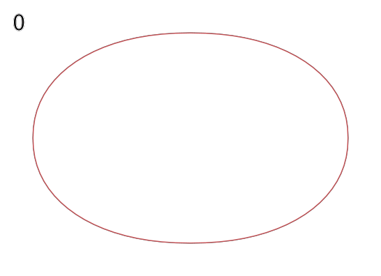
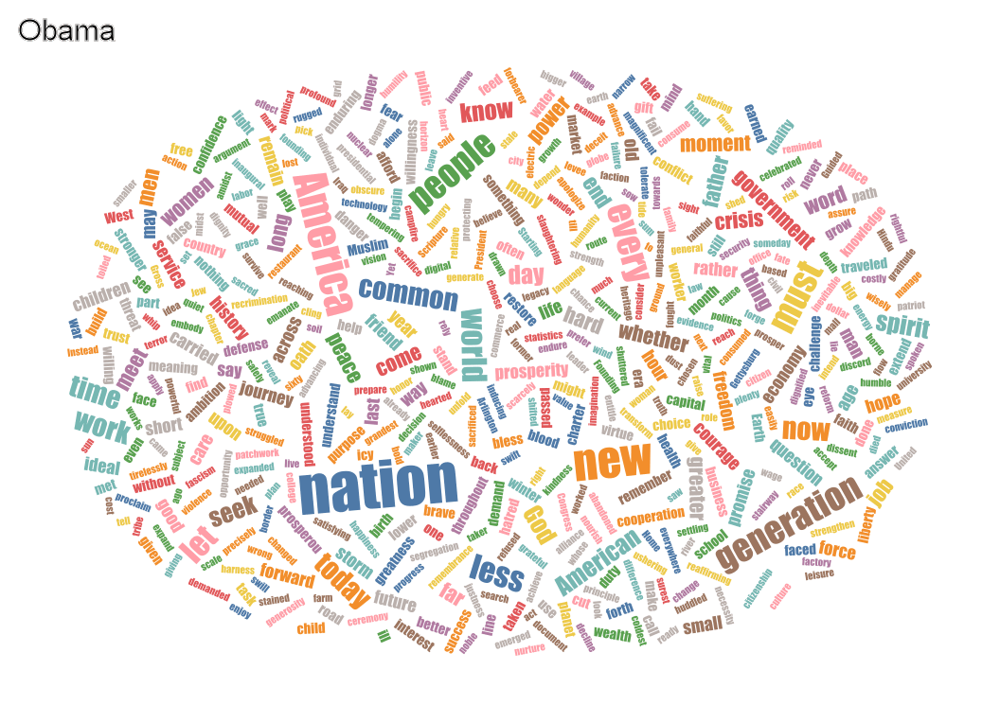
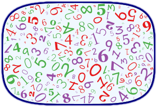

# WordCloud-Gallery
This is a gallery of [WordCloud.jl](https://github.com/guo-yong-zhi/WordCloud), which is automatically generated from `WordCloud.examples` (WordCloud v0.10.12).  Run `evalfile("generate.jl", ["doeval=true", "exception=true"])` in julia REPL to create this file.  
- [alice](#alice)
- [animation1](#animation1)
- [animation2](#animation2)
- [benchmark](#benchmark)
- [compare](#compare)
- [compare2](#compare2)
- [custom](#custom)
- [fromweb](#fromweb)
- [gathering](#gathering)
- [highdensity](#highdensity)
- [hyperlink](#hyperlink)
- [juliadoc](#juliadoc)
- [lettermask](#lettermask)
- [logo](#logo)
- [nomask](#nomask)
- [outline](#outline)
- [pattern](#pattern)
- [qianziwen](#qianziwen)
- [random](#random)
- [recolor](#recolor)
- [semantic](#semantic)
- [svgconfig](#svgconfig)
- [series](#series)
- [中文](#中文)
# alice
```julia
using WordCloud
wc = wordcloud(
    processtext(open(pkgdir(WordCloud) * "/res/alice.txt"), stopwords=WordCloud.stopwords_en ∪ ["said"]), 
    mask=loadmask(pkgdir(WordCloud) * "/res/alice_mask.png", color="#faeef8"),
    colors=:seaborn_dark,
    angles=(0, 90),
    density=0.5) |> generate!
println("results are saved to alice.png")
paint(wc, "alice.png", background=outline(wc.mask, color="purple", linewidth=4))
wc
```  
  
# animation1
This animation shows how the initial layout is generated.
```julia
using WordCloud
stopwords = WordCloud.stopwords_en ∪ ["said"]
textfile = pkgdir(WordCloud)*"/res/alice.txt"
wc = wordcloud(
    processtext(open(textfile), stopwords=stopwords, maxnum=300), 
    masksize = (300, 200),
    outline = 3,
    angles = 0:90,
    state = initwords!)
```  
### uniform style
```julia
gifdirectory = "animation1/uniform"
setpositions!(wc, :, (-1000,-1000))
@record gifdirectory overwrite=true filter=i->i%(2^(i÷100))==0 placewords!(wc, style=:uniform)
```  
  
### gathering style
```julia
gifdirectory = "animation1/gathering"
setpositions!(wc, :, (-1000,-1000))
@record gifdirectory overwrite=true filter=i->i%(2^(i÷100))==0 placewords!(wc, style=:gathering)
```  
  

```julia
println("results are saved in animation1")
wc
```  
# animation2
This animation shows the process of fitting the layout.
```julia
using CSV
using DataFrames
using WordCloud

df = CSV.File(pkgdir(WordCloud) * "/res/guxiang_frequency.txt", header=false) |> DataFrame;
words = df[!, "Column2"]
weights = df[!, "Column3"]

wc = wordcloud(words, weights, density=0.6)
gifdirectory = "animation2"
@record gifdirectory overwrite=true generate!(wc, 100, optimiser=WordCloud.Momentum())
println("results are saved in animation2")
wc
```  
  
# benchmark
Test the performance of different trainers
```julia
using WordCloud
using Random
# Random.seed!(8)

println("This test will take several minutes")
@show Threads.nthreads()
words = [Random.randstring(rand(1:8)) for i in 1:200]
weights = randexp(length(words)) .* 2000 .+ rand(20:100, length(words));
wc1 = wordcloud(words, weights, mask=shape(ellipse, 500, 500, color=0.15), angles=(0, 90, 45), density=0.55)

words = [Random.randstring(rand(1:8)) for i in 1:400]
weights = randexp(length(words)) .* 2000 .+ rand(20:100, length(words));
wc2 = wordcloud(words, weights, mask=shape(ellipse, 500, 500, color=0.15), angles=(0, 90, 45))

words = [Random.randstring(rand(1:8)) for i in 1:5000]
weights = randexp(length(words)) .* 2000 .+ rand(20:100, length(words));
wc3 = wordcloud(words, weights, mask=shape(box, 2000, 2000, cornerradius=100, color=0.15), angles=(0, 90, 45))

wcs = [wc1, wc1, wc2, wc3] # repeat wc1 to trigger compiling
ts = [WordCloud.Stuffing.trainepoch_E!,WordCloud.Stuffing.trainepoch_EM!,
WordCloud.Stuffing.trainepoch_EM2!,WordCloud.Stuffing.trainepoch_EM3!,WordCloud.Stuffing.trainepoch_D!,
WordCloud.Stuffing.trainepoch_P!,WordCloud.Stuffing.trainepoch_P2!,WordCloud.Stuffing.trainepoch_Px!]
es = [[] for i in 1:length(wcs)]
for (i, wc) in enumerate(wcs)
    println("\n\n", "*"^10, "wordcloud - $(length(wc)) words on mask$(size(wc.mask))", "*"^10)
    for (j, t) in enumerate(ts)
        println("\n", i - 1, "==== ", j, "/", length(ts), " ", nameof(t))
        placewords!(wc, style=:uniform)
        @time e = @elapsed generate!(wc, trainer=t, retry=1)
        push!(es[i], "$(nameof(t)) - $(getparameter(wc, :epoch))" * (getstate(wc) == :generate! ? "✔ " : "✘ ") => e)
    end
end
println("SUMMARY")
for (i, (wc, e)) in enumerate(zip(wcs, es))
    println("##$(i - 1) $(length(wc))@$(size(wc.mask)):")
    println(repr("text/plain", e))
end
```  
# compare
### First generate the wordcloud on the left  
```julia
using WordCloud

stwords = ["us"];
println("==Obama's==")
cs = WordCloud.randomscheme() # :Set1_8
as = WordCloud.randomangles() # (0,90,45,-45)
fs = WordCloud.randomfonts()
dens = 0.45 # not too high
wca = wordcloud(
    processtext(open(pkgdir(WordCloud) * "/res/Barack Obama's First Inaugural Address.txt"), stopwords=WordCloud.stopwords_en ∪ stwords), 
    colors=cs,
    angles=as,
    density=dens,
    backgroundcolor=:maskcolor,
    fonts=fs,
    style=:uniform,
    ) |> generate!
```  
### Then generate the wordcloud on the right      
```julia
println("==Trump's==")
wcb = wordcloud(
    processtext(open(pkgdir(WordCloud) * "/res/Donald Trump's Inaugural Address.txt"), stopwords=WordCloud.stopwords_en ∪ stwords),
    mask=getsvgmask(wca),
    colors=cs,
    angles=as,
    density=dens,
    backgroundcolor=:maskcolor,
    maskcolor=getmaskcolor(wca),
    fonts=fs,
    state=identity, # turn off the useless initword! and placewords! in advance
)
```  
Follow these steps to generate a wordcloud: initword! -> placewords! -> generate!
```julia
samewords = getwords(wca) ∩ getwords(wcb)
println(length(samewords), " same words")

for w in samewords
    setcolors!(wcb, w, getcolors(wca, w))
    setangles!(wcb, w, getangles(wca, w))
    setfonts!(wcb, w, getfonts(wca, w))
end
initwords!(wcb)

println("=ignore defferent words=")
keep(wcb, samewords) do
    @assert Set(wcb.words) == Set(samewords)
    centers = getpositions(wca, samewords, type=getcenter)
    setpositions!(wcb, samewords, centers, type=setcenter!) # manually initialize the position,
    setstate!(wcb, :placewords!) # and set the state flag
    generate!(wcb, 1000, reposition=false, retry=1) # turn off the reposition; retry=1 means no rescale
end

println("=pin same words=")
pin(wcb, samewords) do
    placewords!(wcb, style=:uniform)
    generate!(wcb, 1000, retry=1) # allow teleport but don‘t allow rescale
end

if getstate(wcb) != :generate!
    println("=overall tuning=")
    generate!(wcb, 1000, reposition=setdiff(getwords(wcb), samewords), retry=2) # only teleport the unique words
end

ma = paint(wca)
mb = paint(wcb)
h, w = size(ma)
println("results are saved in address_compare")
WordCloud.save("address_compare/compare.png", [ma mb])
gif = WordCloud.GIF("address_compare")
WordCloud.frame(wca, "Obama") |> gif
WordCloud.frame(wcb, "Trump") |> gif
WordCloud.Render.generate(gif, framerate=1)
wca, wcb
```  
  
  
# compare2
This is a more symmetrical and accurate way to generate comparison wordclouds, but it may be more time consuming.  
### Prepare two wordcloud objects
```julia
using WordCloud

stwords = ["us"];
cs = WordCloud.randomscheme() # :Set1_8#
as = WordCloud.randomangles() # (0,90,45,-45)#
fs = WordCloud.randomfonts()
dens = 0.45 # not too high
wca = wordcloud(
    processtext(open(pkgdir(WordCloud) * "/res/Barack Obama's First Inaugural Address.txt"), stopwords=WordCloud.stopwords_en ∪ stwords), 
    colors=cs,
    angles=as,
    density=dens,
    backgroundcolor=:maskcolor,
    fonts=fs,
    state=identity, # turn off the initword! and placewords! in advance
)
wcb = wordcloud(
    processtext(open(pkgdir(WordCloud) * "/res/Donald Trump's Inaugural Address.txt"), stopwords=WordCloud.stopwords_en ∪ stwords),
    mask=getsvgmask(wca),
    colors=cs,
    angles=as,
    density=dens,
    backgroundcolor=:maskcolor,
    maskcolor=getmaskcolor(wca),
    fonts=fs,
    state=identity, 
)
```  
### Make the same words the same style
```julia
samewords = getwords(wca) ∩ getwords(wcb)
println(length(samewords), " same words")
@assert !hasparameter(wca, :uniquewords)
@assert !hasparameter(wcb, :uniquewords)
setparameter!(wca, setdiff(getwords(wca), samewords), :uniquewords)
setparameter!(wcb, setdiff(getwords(wcb), samewords), :uniquewords)
for w in samewords
    setcolors!(wcb, w, getcolors(wca, w))
    setangles!(wcb, w, getangles(wca, w))
    setfonts!(wcb, w, getfonts(wca, w))
end
```  
### Put the same words at same position
```julia
initwords!(wca)
initwords!(wcb)
keep(wca, samewords) do
    placewords!(wca, style=:uniform)
    fit!(wca, 1000)
end
pin(wca, samewords) do
    placewords!(wca, style=:uniform) # place other words
end
centers = getpositions(wca, samewords, type=getcenter)
setpositions!(wcb, samewords, centers, type=setcenter!) # manually initialize the position,
pin(wcb, samewords) do
    placewords!(wcb, style=:uniform) # place other words
end
```  
### Fit them all
```julia
function syncposition(samewords, pos, wca, wcb)
    pos2 = getpositions(wca, samewords, type=getcenter)
    if pos != pos2
        setpositions!(wcb, samewords, pos2, type=setcenter!)
        setstate!(wcb, :placewords!)
    end
    pos2
end
function pinfit!(wc, samewords, ep1, ep2)
    pin(wc, samewords) do
        fit!(wc, ep1)
    end
    fit!(wc, ep2, reposition=getparameter(wc, :uniquewords)) # only teleport the unique words
end
pos = getpositions(wca, samewords, type=getcenter)
while getparameter(wca, :epoch) < 2000 && getparameter(wcb, :epoch) < 2000
    global pos
    pinfit!(wca, samewords, 200, 50)
    pos = syncposition(samewords, pos, wca, wcb)
    pinfit!(wcb, samewords, 200, 50)
    pos = syncposition(samewords, pos, wcb, wca)
    if getstate(wca) == getstate(wcb) == :fit!
        break
    end
end
println("Takes $(getparameter(wca, :epoch)) and $(getparameter(wcb, :epoch)) epochs")
WordCloud.printcollisions(wca)
WordCloud.printcollisions(wcb)
```  

```julia
ma = paint(wca)
mb = paint(wcb)
h, w = size(ma)
println("results are saved in address_compare2")
WordCloud.save("address_compare2/compare2.png", [ma mb])
gif = WordCloud.GIF("address_compare2")
WordCloud.frame(wca, "Obama") |> gif
WordCloud.frame(wcb, "Trump") |> gif
WordCloud.Render.generate(gif, framerate=1)
wca, wcb
```  
  
  
# custom
```julia
using WordCloud
wc = wordcloud(
    processtext(open(pkgdir(WordCloud) * "/res/alice.txt"), stopwords=WordCloud.stopwords_en ∪ ["said"], maxweight=1, maxnum=300), 
    # mask = padding(WordCloud.tobitmap(shape(ellipse, 600, 500, color=(0.98, 0.97, 0.99), backgroundcolor=0.97)), 0.1),
    mask=shape(ellipse, 600, 500, color=(0.98, 0.97, 0.99), backgroundcolor=0.97, backgroundsize=(700, 550)),
    colors=:seaborn_icefire_gradient,
    angles=-90:90,
    state=identity, # turn off the useless initword! and placewords! in advance
)

setwords!(wc, "Alice", "Alice in Wonderland") # replace the word 'Alice' with 'Alice in Wonderland'
setangles!(wc, "Alice in Wonderland", 0) # make it horizontal
setcolors!(wc, "Alice in Wonderland", "purple");
setfontsizes!(wc, "Alice in Wonderland", size(wc.mask, 2) / length("Alice in Wonderland"))
initword!(wc, "Alice in Wonderland")
r = size(wc.mask, 2) / size(getimages(wc, "Alice in Wonderland"), 2) * 0.95
setfontsizes!(wc, "Alice in Wonderland", r * size(wc.mask, 2) / length("Alice in Wonderland")) # set a big font size
initword!(wc, "Alice in Wonderland") # init it after adjust it's style
setpositions!(wc, "Alice in Wonderland", reverse(size(wc.mask)) .÷ 2, type=setcenter!) # center it

pin(wc, "Alice in Wonderland") do
    initwords!(wc) # init inside `pin` to reset the size of other words
    generate!(wc)
end

println("results are saved to custom.svg")
paint(wc, "custom.svg")
wc
```  
  
# fromweb
```julia
using WordCloud
using HTTP

url = "http://en.wikipedia.org/wiki/Special:random"
try
    resp = HTTP.request("GET", url, redirect=true)
    println(resp.request)
    content = resp.body |> String
    wc = wordcloud(content |> html2text |> processtext) |> generate!
    println("results are saved to fromweb.svg")
    paint(wc, "fromweb.svg")
    wc
catch e
    println(e)
end
```  
  
# gathering
Big words will be placed closer to the center
```julia
using WordCloud
wc = wordcloud(
    processtext(open(pkgdir(WordCloud) * "/res/alice.txt"), stopwords=WordCloud.stopwords_en ∪ ["said"]), 
    angles=0, density=0.55,
    mask=squircle, rt=2.5 * rand(),
    state=initwords!)
placewords!(wc, style=:gathering, level=5, centeredword=true)
pin(wc, "Alice") do # keep "Alice" in the center
    generate!(wc, reposition=0.7) # don't teleport largest 30% words
end
println("results are saved to gathering.svg")
paint(wc, "gathering.svg")
wc
```  
  
# highdensity
```julia
using WordCloud
```  
Sometimes you want a high-density output, and you may do it like this:
```julia
wc = wordcloud(
    processtext(open(pkgdir(WordCloud)*"/res/alice.txt"), stopwords=WordCloud.stopwords_en ∪ ["said"]), 
    mask = shape(box, 500, 400, cornerradius=10),
    colors = :Dark2_3,
    angles = (0, 90), #spacing = 2,
    density = 0.7) |> generate!
paint(wc, "highdensity.png")
```
But you may find that doesn't work. 
This is because the minimum gap between two words is set to 2 pixel, which is controlled by the parameter `spacing` of `wordcloud`. 
While, when the picture is small, 1 pixel is relatively more expensive. You can set `spacing=0` or `spacing=1`. Or alternatively, this can be mitigated with a larger picture:
```julia
wc = wordcloud(
    processtext(open(pkgdir(WordCloud) * "/res/alice.txt"), stopwords=WordCloud.stopwords_en ∪ ["said"]), 
    mask=shape(box, 500 * 2, 400 * 2, cornerradius=10 * 2),
    colors=:Dark2_3,
    angles=(0, 90),
    density=0.7) |> generate!
paint(wc, "highdensity.png", ratio=0.5)
```  

```julia
println("results are saved to highdensity.png")
wc
```  
  
# hyperlink
Hyperlinks can be attached with wrapper SVG tag pairs like `<a href="https://www.google.com/search?q=$w">` and `</a>`. 
The function `configsvgimages!` provides this capability.
```julia
using WordCloud
push!(WordCloud.stopwords, "said")
wc = wordcloud(open(pkgdir(WordCloud) * "/res/alice.txt")) |> generate!
for w in getwords(wc)
    configsvgimages!(wc, w, wrappers="a"=>("href", "https://www.google.com/search?q=$w"))
end
println("results are saved to hyperlink.svg")
paint(wc, "hyperlink.svg")
wc
```  
  
# juliadoc
```julia
using WordCloud
function drawjuliacircle(sz)
    juliacirclessvg = WordCloud.Render.Drawing(sz, sz, :svg)
    WordCloud.Render.origin()
    WordCloud.Render.background(0, 0, 0, 0)
    WordCloud.Render.juliacircles(sz ÷ 4)
    WordCloud.Render.finish()
    juliacirclessvg
end

docs = (readdir(joinpath(dirname(Sys.BINDIR), "share/doc/julia/html/en", dir), join=true) for dir in ["manual", "base", "stdlib"])
docs = docs |> Iterators.flatten

words, weights = processtext(maxnum=400, maxweight=1) do
    counter = Dict{String,Int}()
    for doc in docs
        content = html2text(open(doc))
        countwords(content, counter=counter)
    end
    counter
end

wc = wordcloud(
    [words..., "∴"], # add a placeholder for julia-logo
    [weights..., weights[1]], 
    density=0.55,
    mask=shape(box, 900, 300, cornerradius=0, color=0.95),
    colors=((0.796, 0.235, 0.20), (0.584, 0.345, 0.698), (0.22, 0.596, 0.149)),
    angles=(0, -45, 45),
    # fonts = "Verdana Bold",
    maxfontsize = 300,
)
setangles!(wc, "julia", 0)
# setangles!(wc, "function", 45)
# initword!(wc, "function")
setcolors!(wc, "julia", (0.796, 0.235, 0.20))
# setfonts!(wc, "julia", "forte")
initword!(wc, "julia")
juliacircles = drawjuliacircle(getfontsizes(wc, "∴") |> round)
setsvgimages!(wc, "∴", juliacircles) # replace image
sz1 = size(getimages(wc, "∴"))
sz2 = size(getimages(wc, "julia"))
y1, x1 = (size(wc.mask) .- (sz1[1], sz1[2] + sz2[2])) .÷ 2
y2 = (size(wc.mask, 1) - sz2[1]) ÷ 2
x1 = round(Int, x1 * 0.9)
setpositions!(wc, "∴", (x1, y1))
setpositions!(wc, "julia", (x1 + sz1[2], y2))

pin(wc, ["julia", "∴"]) do
    placewords!(wc)
    generate!(wc, 2000)
end
println("results are saved to juliadoc.svg")
# paint(wc, "juliadoc.png")
paint(wc, "juliadoc.svg")
wc
```  
  
# lettermask
```julia
using WordCloud
mask = rendertext("World", 1000, border=10, color=0.9, backgroundcolor=0.98, type=:svg, font="Sans Bold")
words = repeat(["we", "are", "the", "world"], 150)
weights = repeat([1], length(words))
wc = wordcloud(
        words, weights, 
        mask=mask,
        angles=0,
        colors=("#006BB0", "#EFA90D", "#1D1815", "#059341", "#DC2F1F"),
        density=0.55,
        ) |> generate!
println("results are saved to lettermask.svg")
paint(wc, "lettermask.svg" , background=false)
wc
```  
  
# logo
It is the code to draw this repo's logo 
```julia
using WordCloud
Luxor = WordCloud.Render.Luxor

function cloudshape(height, args...; backgroundcolor=(0, 0, 0, 0))
    height = ceil(height)
    r = height / 2
    d = Luxor.Drawing((2height, height)..., :svg)
    Luxor.origin()
    Luxor.background(parsecolor(backgroundcolor))
    Luxor.setcolor(parsecolor((0.22, 0.596, 0.149)))
    Luxor.pie(0, 0, r, 0, 2π, :fill)
    Luxor.setcolor(parsecolor((0.584, 0.345, 0.698)))
    Luxor.pie(r, r, r, -π, 0, :fill)
    Luxor.setcolor(parsecolor((0.796, 0.235, 0.20)))
    Luxor.Luxor.pie(-r, r, r, -π, 0, :fill)
    Luxor.finish()
    d
end
wc = wordcloud(
    repeat(string.('a':'z'), 5),
    repeat([1], 26 * 5),
    mask=cloudshape(500),
    transparent=(0, 0, 0, 0),
    colors=1,
    angles=-90:0,
    fonts="JuliaMono Black",
    density=0.7,
    )
generate!(wc, 2000, retry=1)
recolor!(wc, style=:main)
println("results are saved to logo.svg")
paint(wc, "logo.svg", background=false)
wc
```  
  
# nomask
The word clouds generated by WordCloud.jl are always with a mask, but we can imitate the no-mask-style through the following steps:
* set a lower density
* set the background color as the mask color
* gathering style placement
* generating with repositioning off
```julia
using WordCloud
wc = wordcloud(
    processtext(open(pkgdir(WordCloud) * "/res/Donald Trump's Inaugural Address.txt"), maxweight=1, minweight=0),
    density=0.3,
    mask=box,
    cornerradius=0,
    masksize=(1200, 900),
    backgroundcolor=:maskcolor,
    angles=rand((0, (0, 90))),
    state=identity,
)
```  
place words in the center of the background to prevent encountering the mask boundary
```julia
placewords!(wc, style=:gathering, reorder=WordCloud.shuffle, level=6, rt=1) # a proper level is important, and so is luck
paint(wc, "nomask-placewords.svg")
```  

prevent repositioning words to the surrounding blank space
```julia
generate!(wc, reposition=false)
paint(wc, "nomask.svg")
wc
```  

# outline
```julia
using WordCloud
words = (1:200) .% 10 .|> string
weights = (1:200) .% 11 .+ 1
```  
### SVG
You can directly set the `outline` and `maskcolor` in `wordcloud`
```julia
wc1 = wordcloud(
    words, weights,
    mask = squircle, rt=0.5,
    masksize = (300, 200),
    maskcolor = "AliceBlue",
    outline = 6, linecolor = "navy"
) |> generate!
```  
Or if you already have a SVG mask with outline, you should set a proper transparent region in `wordcloud`
```julia
svgmask = shape(squircle, 300, 200, outline=6, linecolor="navy", color="AliceBlue")
wc1 = wordcloud(
    words, weights,
    mask = svgmask,
    transparent=c -> c != WordCloud.torgba("AliceBlue"), # the outline should be regarded as transparent too
) |> generate!

paint(wc1, "outline.svg")
println("results are saved to outline.svg")
```  
  
### Bitmap
If you already have a bitmap mask without outline, you can outline it before painting
```julia
bitmapmask = WordCloud.tobitmap(shape(squircle, 300, 200, color="AliceBlue", backgroundsize=(312, 212)))
wc2 = wordcloud(
    words, weights,
    mask = bitmapmask,
) |> generate!
paint(wc2, "outline.png", background=outline(bitmapmask, color="navy", linewidth=6, smoothness=0.8))
println("results are saved to outline.png")
```  
  
```julia
wc1, wc2
```  
# pattern
The [engine](https://github.com/guo-yong-zhi/Stuffing.jl) is designed for general purpose, so the outputs don't have to be text, and shapes are OK
```julia
using WordCloud

sc = WordCloud.randomscheme() |> unique #unique makes Int -> Vector{Int}
l = 200
wc = wordcloud(
    repeat(["placeholder"], l), repeat([1], l), 
    mask=shape(box, 400, 300, color=WordCloud.randommaskcolor(sc)),
    state=identity)
```  
* `words` & `weights` are just placeholders  
* style arguments like `colors`, `angles` and `density` have no effect  

And, you should manually initialize images for the placeholders, instead of calling `initwords!`  
```julia
dens = 0.6
sz = 3expm1.(rand(l)) .+ 1
sz ./= √(sum(π * (sz ./ 2).^2 ./ dens) / prod(size(wc.mask))) # set a proper size according to the density
## svg version
# shapes = [shape(ellipse, round(sz[i]), round(sz[i]), color=rand(sc)) for i in 1:l]
# setsvgimages!(wc, :, shapes)
## bitmap version
shapes = WordCloud.tobitmap.([shape(ellipse, round(sz[i]), round(sz[i]), color=rand(sc)) for i in 1:l])
setimages!(wc, :, shapes)

setstate!(wc, :initwords!) # set the state flag after manual initialization
@record "pattern_animation" overwrite=true generate!(wc, retry=1, optimiser=WordCloud.Momentum(η=1/8))
# generate!(wc, retry=1, optimiser=WordCloud.Momentum(η=1/8)) # turn off rescale attempts. manually set images can't be rescaled
println("results are saved to pattern.png")
paint(wc, "pattern.png")
wc
```  
  
  
# qianziwen
```julia
using WordCloud
words = "天地玄黄宇宙洪荒日月盈昃辰宿列张寒来暑往秋收冬藏闰余成岁律吕调阳云腾致雨露结为霜金生丽水玉出昆冈剑号巨阙珠称夜光果珍李柰菜重芥姜海咸河淡鳞潜羽翔龙师火帝鸟官人皇始制文字乃服衣裳推位让国有虞陶唐吊民伐罪周发殷汤坐朝问道垂拱平章"
words = [string(c) for c in words]
weights = rand(length(words)).^2 .* 100 .+ 30
wc = wordcloud(words, weights, spacing=0, density=0.75)
generate!(wc)
```  
# random
```julia
using WordCloud
using Random
words = [randstring(rand(1:8)) for i in 1:300]
weights = randexp(length(words))
wordcloud(words, weights) |> generate!
```  
# recolor
```julia
using WordCloud
using Random
```  
 
```julia
istrans = c -> maximum(c[1:3]) * (c[4] / 255) < 128
background, mask = loadmask(pkgdir(WordCloud) * "/res/butterfly.png", transparent=istrans, return_bitmask=true)
showmask(background, mask, highlight=(1, 0, 0, 0.7))
```  
`showmask` might be helpful to find a proper `istrans` function. `using Images` may be required.
```julia
words = [randstring(1) for i in 1:600]
weights = randexp(length(words)) .+ 1

wc = wordcloud(
    words, weights,
    mask=background,
    colors="LimeGreen",
    angles=-30,
    density=0.4,
    transparent=istrans,
    spacing=1,
) |> generate!;
```  
## average style
```julia
recolor!(wc, style=:average)
avgimg = paint(wc, background=loadmask(background, color=0.99))
```  
## clipping style
```julia
recolor!(wc, style=:clipping)
clipimg = paint(wc, background=loadmask(background, color=0.99))
```  
## blending style
```julia
recolor!(wc, style=:reset)
recolor!(wc, style=:blending, alpha=0.5) # blending with origin color - LimeGreen
blendimg = paint(wc, background=loadmask(background, color=0.99))
```  
## mix style
styles can also be mixed
```julia
# setcolors!(wc, :, "LimeGreen")
recolor!(wc, style=:reset)
recolor!(wc, 1:3:length(words), style=:average) # vector index is ok
recolor!(wc, 2:3:length(words), style=:clipping)
recolor!(wc, 3:3:length(words), style=:blending)
setcolors!(wc, 200:250, "black")
recolor!(wc, 200:250, style=:reset)
setcolors!(wc, 1, "black")
recolor!(wc, 1, style=:reset) # single index is ok
mixstyleimg = paint(wc, background=loadmask(background, color=0.99))
```  

```julia
h, w = size(avgimg)
lw = 21
lc = eltype(avgimg)(parsecolor(0.1))
vbar = zeros(eltype(avgimg), (h, lw))
hbar = zeros(eltype(avgimg), (lw, 2w + lw))
vbar[:, lw ÷ 2 + 1] .= lc
hbar[lw ÷ 2 + 1, :] .= lc
image = [avgimg vbar clipimg; hbar; blendimg vbar mixstyleimg]
println("results are saved to recolor.png")
WordCloud.save("recolor.png", image)
wc
```  
  
# semantic
### Words
```julia
using WordCloud
stwords = ["us"];
words_weights = processtext(open(pkgdir(WordCloud) * "/res/Barack Obama's First Inaugural Address.txt"), stopwords=WordCloud.stopwords_en ∪ stwords)
words_weights = Dict(zip(words_weights...))
```  
### Embedding
The positions of words can be initialized with pre-trained word vectors so that similar words will appear near each other.
```julia
using Embeddings
using TSne
const embtable = load_embeddings(GloVe{:en})
const get_word_index = Dict(word => ii for (ii, word) in enumerate(embtable.vocab))
function get_embedding(word)
    ind = get_word_index[word]
    emb = embtable.embeddings[:,ind]
    return emb
end
wordvec = Dict()
for k in keys(words_weights)
    if k in keys(get_word_index)
        wordvec[k] = get_embedding(k)
    elseif lowercase(k) in keys(get_word_index)
        wordvec[k] = get_embedding(lowercase(k))
    else
        pop!(words_weights, k)
        println("remove ", k)
    end
end
words = keys(wordvec) |> collect
vectors = hcat(values(wordvec)...)
embedded = tsne(vectors', 2)
```  

```julia
wc = wordcloud(
    words_weights,
    mask=box,
    masksize=(1000, 1000),
    cornerradius=0,
    density=0.3,
    colors=0.3,
    backgroundcolor=:maskcolor,
    state=initwords!,
    # angles = (0,45), fonts = "Helvetica thin", maskcolor=0.98,
)

pos = embedded
mean = sum(pos, dims=1) / size(pos, 1)
r = maximum(sqrt.(pos[:,1].^2 + pos[:,2].^2))
pos = (pos .- mean) ./ 2r
sz = collect(reverse(size(wc.mask)))'
sz0 = collect(getparameter(wc, :masksize)[1:2])'
pos = round.(Int, pos .* sz0 .+ sz ./ 2)

setpositions!(wc, words, eachrow(pos), type=setcenter!)
setstate!(wc, :placewords!)
generate!(wc, reposition=false)
paint(wc, "semantic_embedding.png")
```  
  
### Clustering
Words can be further colored according to semantic clustering
```julia
using Clustering
V = vectors
G = V' * V
H = sum(V.^2, dims=1)
D = max.(0, (H .+ H' .- 2G))
D ./= sum(D) / length(D)
D .= .√D # the distance matrix
tree = hclust(D, linkage=:ward)
lb = cutree(tree, h=2, k=10)
println("$(length(lb)) words are divided into $(length(unique(lb))) groups")
```  

```julia
colors = parsecolor(:seaborn_dark)
setcolors!(wc, words, colors[lb .% length(colors) .+ 1])
recolor!(wc, style=:reset)
paint(wc, "semantic_clustering.png")
```  
  
```julia
wc
```  
# svgconfig
```julia
using WordCloud
```  
### Generate a word cloud first
```julia
push!(WordCloud.stopwords, "said")
wc = wordcloud(open(pkgdir(WordCloud) * "/res/alice.txt")) |> generate!
```  
### Add hyperlinks for each tag
This can be done by adding a wrapper SVG node `<a>`
* SVG ElementNode: `<a href="https://www.google.com/search?q=$w">` and `</a>`
```julia
configsvgimages!(wc, wrappers = ["a" => ("href" => "https://www.google.com/search?q=$w") for w in getwords(wc)])
```  
### Add flicker, rotation animations and tooltips
These things can be done by adding child nodes `<animate>`, `<animateTransform>` and `<title>`.
* SVG ElementNode: `<animate attributeName="opacity" values="1;0.5;1" dur="6s" repeatCount="indefinite"/>`
* SVG ElementNode: `<animateTransform attributeName="transform" type="rotate" from="0 $(w/2) $(h/2)" to="360 $x $y" dur="6s" repeatCount="indefinite"/>`
* SVG TextNode: `<title>$word</title>`
```julia
flicker = "animate" => ["attributeName" => "opacity", "values" => "1;0.5;1", "dur" => "6s", "repeatCount" => "indefinite"]
h, w = getmask(wc) |> size
for word in getwords(wc)
    x, y = getpositions(wc, word, type = getcenter)
    rotation = "animateTransform" => [
        "attributeName" => "transform",
        "type" => "rotate",
        "from" => "0 $(w/2) $(h/2)",
        "to" => "360 $x $y",
        "dur" => "6s",
        "repeatCount" => "indefinite"
    ]
    title = "title" => word
    configsvgimages!(wc, word, children = (flicker, rotation, title))
end
println("results are saved to svgconfig.svg")
paint(wc, "svgconfig.svg")
wc
```  
  
# series
This example shows how to generate a dynamic word cloud on series data.
### Prepare some data
We use the GDP of countries from 2000 to 2020 as an example.
```julia
using WorldBankData
using DataFrames
df0 = wdi("NY.GDP.MKTP.CD", "all", 2000, 2020) #GDP from 2000 to 2020
df0.year = round.(Int, df0[!, :year])
df = unstack(df0, :year, :NY_GDP_MKTP_CD)
country_groups = ["XC", "EU", "XE", "XD", "XF", "ZB", "ZT", "XH", "XI", "XG", "ZJ", "XJ", "XL", "XO", 
    "XM", "XN", "ZQ", "XQ", "XP", "XU", "XY", "OE", "ZG", "ZF", "XT"]|>Set # https://rpubs.com/federicoganz/749793
countrymask = .!occursin.(r"\d" , df.iso2c) .& .!in.(df.iso2c, Ref(country_groups))
df = df[countrymask, 2:end]
df[!, 2:end] .= sqrt.(df[!, 2:end] ./ length.(df.country))
df.country = replace.(df.country, " "=>"\n") #some names are too long
for i in 1:size(df, 1) #interpolation, fill missing
    for j in 3:size(df, 2)
        if ismissing(df[i, j])
            df[i, j] = df[i, j-1]
        end
    end
end
```  
### Generate the wordcloud
```julia
using WordCloud
function gather!(wc, i=1:length(wc), r=1)
    O = reverse(size(getmask(wc))) .÷ 2
    order1 = sortperm(sortperm(getpositions(wc, i, type=getcenter), by=p->sum((p .- O).^2)))
    order2 = sortperm(getweights(wc, i))
    radial = Int.(order2 .> order1)
    gatheritem!.(wc, WordCloud.index(wc, i), r.*radial);
end
function gatheritem!(wc, i, r=1)
    r == 0 && return
    C = getpositions(wc, i, type=getcenter)
    Δ = sign.(reverse(size(getmask(wc))) .÷ 2 .- C)
    setpositions!(wc, i, C .+ r .* Δ, type=setcenter!)
end
```  
These two functions are ussed to forcing large words to the center, but are not essential.
```julia
wc = wordcloud(df.country, 1, angles=0)
gif = WordCloud.GIF("series")
println("results are saved in series")
@assert length(unique(df[!, 1])) == length(df[!, 1])
initialized = false
for name in names(df)[2:end] #the first column is word list
    words = df[!, 1]
    weights = df[!, name]
    missingmask = ismissing.(weights)
    setweights!.(wc, words[.!missingmask], weights[.!missingmask])
    println("#"^9, name, "#"^9)
    ignore(wc, words[missingmask]) do
        global initialized
        words = getwords(wc)
        pos = getpositions(wc, type=getcenter)
        initwords!(wc)
        if !initialized
            placewords!(wc, style=:gathering)
            initialized = true
        else
            setpositions!(wc, words, pos, type=setcenter!)
            setstate!(wc, :placewords!)
        end
        generate!(wc, callback_pre=ep->(ep%5==0 && gather!(wc, 1:length(wc)÷5, 5)))
        WordCloud.frame(wc, name) |> gif
        # display(wc)
    end
end
WordCloud.Render.generate(gif, framerate=4)
wc
```  
  
# 中文
中文需要分词，可以通过PythonCall调用python版的结巴分词  
```julia

using CondaPkg; CondaPkg.add("jieba")
using WordCloud
using PythonCall

jieba = pyimport("jieba")

TheInternationale = "起来，饥寒交迫的奴隶！\n起来，全世界受苦的人！\n满腔的热血已经沸腾，\n要为真理而斗争！\n旧世界打个落花流水，\n奴隶们起来，起来！\n不要说我们一无所有，\n我们要做天下的主人！\n\n这是最后的斗争，\n团结起来到明天，\n英特纳雄耐尔\n就一定要实现！\n这是最后的斗争，\n团结起来到明天，\n英特纳雄耐尔\n就一定要实现！\n\n从来就没有什么救世主，\n也不靠神仙皇帝！\n要创造人类的幸福，\n全靠我们自己！\n我们要夺回劳动果实，\n让思想冲破牢笼！\n快把那炉火烧得通红，\n趁热打铁才能成功！\n\n是谁创造了人类世界？\n是我们劳动群众！\n一切归劳动者所有，\n哪能容得寄生虫？！\n最可恨那些毒蛇猛兽，\n吃尽了我们的血肉！\n一旦把它们消灭干净，\n鲜红的太阳照遍全球！\n"

jieba.add_word("英特纳雄耐尔")

wc = wordcloud(
    processtext(pyconvert(Vector{String}, jieba.lcut(TheInternationale))), 
    colors="#DE2910",
#     mask = WordCloud.randommask(400, color="#FFDE00"),
    mask=pkgdir(WordCloud) * "/res/heart_mask.png",
    maskcolor="#FFDE00",
    density=0.65) |> generate!

println("结果保存在 中文.png")
paint(wc, "中文.png")
wc
```  
  
