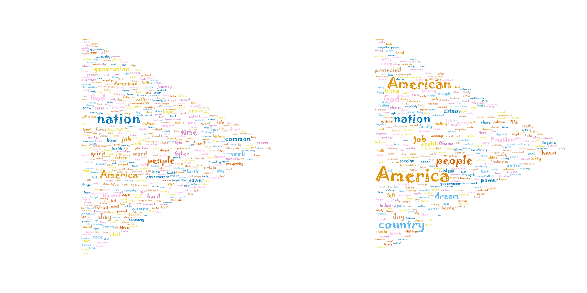
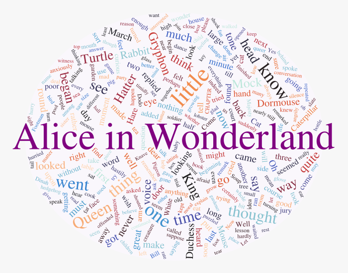

# WordCloud-Gallery
This is a gallery of [WordCloud](https://github.com/guo-yong-zhi/WordCloud), which is automatically generated from `WordCloud.examples` (WordCloud v0.6.1).  Run `evalfile("generate.jl", ["doeval=true", "exception=true"])` in julia REPL to create this file.  
- [alice](#alice)
- [animation](#animation)
- [benchmark](#benchmark)
- [compare](#compare)
- [fromweb](#fromweb)
- [gathering](#gathering)
- [juliadoc](#juliadoc)
- [lettermask](#lettermask)
- [pattern](#pattern)
- [qianziwen](#qianziwen)
- [random](#random)
- [specifiedstyle](#specifiedstyle)
- [中文](#中文)
# alice
```julia
using WordCloud
wc = wordcloud(
    processtext(open(pkgdir(WordCloud)*"/res/alice.txt"), stopwords=WordCloud.stopwords_en ∪ ["said"]), 
    mask = loadmask(pkgdir(WordCloud)*"/res/alice_mask.png", color="#faeef8"),
    colors = :seaborn_dark,
    angles = (0, 90),
    density = 0.55) |> generate!
println("results are saved to alice.png")
paint(wc, "alice.png", background=outline(wc.mask, color="purple", linewidth=1))
wc
```  
  
# animation
```julia
using CSV
using DataFrames
using WordCloud

df = CSV.File(pkgdir(WordCloud)*"/res/guxiang_frequency.txt", header=false)|> DataFrame;
words = df[!, "Column2"]
weights = df[!, "Column3"]

wc = wordcloud(words, weights, density=0.7)
gifdirectory = "guxiang_animation"
generate_animation!(wc, 100, outputdir=gifdirectory)
println("results are saved in guxiang_animation")
wc
```  
  
# benchmark
Test the performance of different trainers
```julia
using WordCloud
using Random

println("This test will take several minutes")
@show Threads.nthreads()
words = [Random.randstring(rand(1:8)) for i in 1:200]
weights = randexp(length(words)) .* 2000 .+ rand(20:100, length(words));
wc1 = wordcloud(words, weights, mask=shape(ellipse, 500, 500, color=0.15), angles=(0,90,45), density=0.55)

words = [Random.randstring(rand(1:8)) for i in 1:500]
weights = randexp(length(words)) .* 2000 .+ rand(20:100, length(words));
wc2 = wordcloud(words, weights, mask=shape(ellipse, 500, 500, color=0.15), angles=(0,90,45))

words = [Random.randstring(rand(1:8)) for i in 1:5000]
weights = randexp(length(words)) .* 2000 .+ rand(20:100, length(words));
wc3 = wordcloud(words, weights, mask=shape(box, 2000, 2000, 100, color=0.15), angles=(0,90,45))

wcs = [wc1, wc1, wc2, wc3] #repeat wc1 to trigger compiling
ts = [WordCloud.Stuffing.trainepoch_E!,WordCloud.Stuffing.trainepoch_EM!,
WordCloud.Stuffing.trainepoch_EM2!,WordCloud.Stuffing.trainepoch_EM3!,
WordCloud.Stuffing.trainepoch_P!,WordCloud.Stuffing.trainepoch_P2!,WordCloud.Stuffing.trainepoch_Px!]
es = [[] for i in 1:length(wcs)]
for (i,wc) in enumerate(wcs)
    println("\n\n", "*"^10, "wordcloud - $(length(wc.words)) words on mask$(size(wc.mask))", "*"^10)
    for (j,t) in enumerate(ts)
        println("\n", i-1, "==== ", j, "/", length(ts), " ", nameof(t))
        placement!(wc)
        @time e = @elapsed generate!(wc, trainer=t, retry=1)
        push!(es[i],nameof(t)=>e)
    end
end
println("SUMMARY")
for (i,(wc,e)) in enumerate(zip(wcs, es))
    println("##$(i-1) $(length(wc.words))@$(size(wc.mask)):")
    println(repr("text/plain", e))
end
```  
# compare
### First generate the wordcloud on the left  
```julia
using WordCloud

stwords = ["us", "will"];
println("==Obama's==")
cs = WordCloud.randomscheme() #:Set1_8
as = WordCloud.randomangles() #(0,90,45,-45)
dens = 0.55 #not too high
wca = wordcloud(
    processtext(open(pkgdir(WordCloud)*"/res/Barack Obama's First Inaugural Address.txt"), stopwords=WordCloud.stopwords_en ∪ stwords), 
    colors = cs,
    angles = as,
    density = dens) |> generate!
```  
### Then generate the wordcloud on the right      
```julia
println("==Trump's==")
wcb = wordcloud(
    processtext(open(pkgdir(WordCloud)*"/res/Donald Trump's Inaugural Address.txt"), stopwords=WordCloud.stopwords_en ∪ stwords),
    mask = getsvgmask(wca),
    colors = cs,
    angles = as,
    density = dens,
    run = x->nothing, #turn off the useless initimage! and placement! in advance
)
```  
Follow these steps to generate a wordcloud: initimage! -> placement! -> generate!
```julia
samewords = getwords(wca) ∩ getwords(wcb)
println(length(samewords), " same words")

for w in samewords
    setcolors!(wcb, w, getcolors(wca, w))
    setangles!(wcb, w, getangles(wca, w))
end
initimages!(wcb)

println("=ignore defferent words=")
keep(wcb, samewords) do
    @assert Set(wcb.words) == Set(samewords)
    centers = getpositions(wca, samewords, type=getcenter)
    setpositions!(wcb, samewords, centers, type=setcenter!) #manually initialize the position,
    setstate!(wcb, :placement!) #and set the state flag
    generate!(wcb, 1000, patient=-1, retry=1) #patient=-1 means no teleport; retry=1 means no rescale
end

println("=pin same words=")
pin(wcb, samewords) do
    placement!(wcb)
    generate!(wcb, 1000, retry=1) #allow teleport but don‘t allow rescale
end

if getstate(wcb) != :generate!
    println("=overall tuning=")
    generate!(wcb, 1000, patient=-1, retry=2) #allow rescale but don‘t allow teleport
end

ma = paint(wca)
mb = paint(wcb)
h,w = size(ma)
space = fill(mb[1], (h, w÷20))
try mkdir("address_compare") catch end
println("results are saved in address_compare")
WordCloud.save("address_compare/compare.png", [ma space mb])
gif = WordCloud.GIF("address_compare")
record(wca, "Obama", gif)
record(wcb, "Trump", gif)
WordCloud.Render.generate(gif, framerate=1)
wca, wcb
```  
  
  
# fromweb
```julia
using WordCloud
using HTTP

url = "https://en.wikipedia.org/wiki/Julia_(programming_language)"
try
    content = HTTP.request("GET", url).body |> String
    wc = wordcloud(content|>html2text|>processtext)|>generate!
    println("results are saved to fromweb.png")
    paint(wc, "fromweb.png")
    wc
catch e
    println(e)
end
```  
  
# gathering
Big words will be placed closer to the center
```julia
using WordCloud
wc = wordcloud(
    processtext(open(pkgdir(WordCloud)*"/res/alice.txt"), stopwords=WordCloud.stopwords_en ∪ ["said"]), 
    angles = 0,
    density = 0.6,
    run = initimages!)
placement!(wc, style=:gathering, level=5)
generate!(wc, patient=-1)
println("results are saved to gathering.svg")
paint(wc, "gathering.svg")
wc
```  
  
# juliadoc
```julia
using WordCloud
function drawjuliacircle(sz)
    juliacirclessvg = WordCloud.Render.Drawing(sz, sz, :svg)
    WordCloud.Render.origin()
    WordCloud.Render.background(0,0,0,0)
    WordCloud.Render.juliacircles(sz÷4)
    WordCloud.Render.finish()
    juliacirclessvg
end

docs = (readdir(joinpath(dirname(Sys.BINDIR), "share/doc/julia/html/en", dir), join=true) for dir in ["manual", "base", "stdlib"])
docs = docs |> Iterators.flatten

words, weights = processtext(maxnum=400, maxweight=1) do
    counter = Dict{String,Int}()
    for doc in docs
        content = html2text(open(doc))
        countwords(content, counter=counter)
    end
    counter |> casemerge!
end

wc = wordcloud(
    [words..., "∴"], #add a placeholder for julia-logo
    [weights..., weights[1]], 
    density = 0.65,
    mask = shape(box, 900, 300, 0, color=0.95, backgroundcolor=(0,0,0,0)),
    colors = ((0.796,0.235,0.20), (0.584,0.345,0.698), (0.22,0.596,0.149)),
    angles = (0, -45, 45),
    # font = "Georgia",
    transparentcolor=(0,0,0,0),
)
setangles!(wc, "julia", 0)
# setangles!(wc, "function", 45)
# initimage!(wc, "function")
setcolors!(wc, "julia", (0.796,0.235,0.20))
# setfonts!(wc, "julia", "forte")
initimage!(wc, "julia")
juliacircles = drawjuliacircle(getfontsizes(wc, "∴")|>round)
setsvgimages!(wc, "∴", juliacircles) #replace image
sz1 = size(getimages(wc, "∴"))
sz2 = size(getimages(wc, "julia"))
y1, x1 = (size(wc.mask) .- (sz1[1], sz1[2]+sz2[2])) .÷ 2
y2 = (size(wc.mask, 1) - sz2[1]) ÷ 2
x1 = round(Int, x1 * 0.9)
setpositions!(wc, "∴", (x1, y1))
setpositions!(wc, "julia", (x1+sz1[2], y2))

pin(wc, ["julia", "∴"]) do
    placement!(wc)
    generate!(wc, 2000)
end
println("results are saved to juliadoc.svg")
# paint(wc, "juliadoc.png")
paint(wc, "juliadoc.svg")
wc
```  
  
# lettermask
```julia
using WordCloud
mask = rendertext("World", 1000, border=10, color=0.9, backgroundcolor=0.98, type=:svg, font="Georgia-Bold")
words = repeat(["we", "are", "the", "world"], 150)
weights = repeat([1], length(words))
wc = wordcloud(
        words, weights, 
        mask = mask,
        angles = 0,
        colors = ("#006BB0", "#EFA90D", "#1D1815", "#059341", "#DC2F1F"),
        density=0.55,
        ) |> generate!
println("results are saved to lettermask.svg")
paint(wc, "lettermask.svg" , background=false)
wc
```  
  
# pattern
The [engine](https://github.com/guo-yong-zhi/Stuffing.jl) is designed for general purpose, so the outputs don't have to be text, and shapes are OK
```julia
using WordCloud

sc = WordCloud.randomscheme()
l = 200
wc = wordcloud(
    repeat(["placeholder"], l), repeat([1], l), 
    mask = shape(box, 400, 300, color=WordCloud.chooseabgcolor(sc)),
    transparentcolor = (0,0,0,0),
    run=x->x)
```  
* `words` & `weights` are just placeholders  
* style arguments like `colors`, `angles` and `density` have no effect  

And, you should manually initialize images for the placeholders, instead of calling `initimages!`  
```julia
dens = 0.6
sz = 3expm1.(rand(l)) .+ 1
sz ./= √(sum(π * (sz ./ 2).^2 ./ dens) / prod(size(wc.mask))) # set a proper size according to the density
## svg version
#shapes = [shape(ellipse, round(sz[i]), round(sz[i]), color=rand(sc)) for i in 1:l]
#setsvgimages!(wc, :, shapes)
## bitmap version
shapes = WordCloud.svg2bitmap.([shape(ellipse, round(sz[i]), round(sz[i]), color=rand(sc)) for i in 1:l])
setimages!(wc, :, shapes)

setstate!(wc, :initimages!) #set the state flag after manual initialization
# generate_animation!(wc, retry=1, outputdir="pattern_animation")
generate!(wc, retry=1) #turn off rescale attempts. manually set images can't be rescaled
println("results are saved to pattern.png")
paint(wc, "pattern.png")
wc
```  
  
# qianziwen
```julia
using WordCloud
words = "天地玄黄宇宙洪荒日月盈昃辰宿列张寒来暑往秋收冬藏闰余成岁律吕调阳云腾致雨露结为霜金生丽水玉出昆冈剑号巨阙珠称夜光果珍李柰菜重芥姜海咸河淡鳞潜羽翔龙师火帝鸟官人皇始制文字乃服衣裳推位让国有虞陶唐吊民伐罪周发殷汤坐朝问道垂拱平章"
words = [string(c) for c in words]
weights = rand(length(words)) .^ 2 .* 100 .+ 30
wc = wordcloud(words, weights)
generate!(wc)
```  
# random
```julia
using WordCloud
using Random

words = [Random.randstring(rand(1:8)) for i in 1:500]
weights = randexp(length(words)) .* 2000 .+ rand(20:100, length(words));
wc = wordcloud(words, weights, mask=shape(ellipse, 500, 500, color=0.15), angles=(0,90,45)) |> generate!
```  
# specifiedstyle
```julia
using WordCloud
wc = wordcloud(
    processtext(open(pkgdir(WordCloud)*"/res/alice.txt"), stopwords=WordCloud.stopwords_en ∪ ["said"], maxweight=1, maxnum=300), 
    # mask = padding(WordCloud.svg2bitmap(shape(ellipse, 600, 500, color=(0.98, 0.97, 0.99), backgroundcolor=0.97)), 0.1),
    mask = shape(ellipse, 600, 500, color=(0.98, 0.97, 0.99), backgroundcolor=0.97, backgroundsize=(700, 550)),
    colors = :seaborn_icefire_gradient,
    angles = -90:90,
    run=x->x, #turn off the useless initimage! and placement! in advance
)

setwords!(wc, "Alice", "Alice in Wonderland") # replace the word 'Alice' with 'Alice in Wonderland'
setangles!(wc, "Alice in Wonderland", 0) # make it horizontal
setcolors!(wc, "Alice in Wonderland", "purple");
setfontsizes!(wc, "Alice in Wonderland", 2.05size(wc.mask, 2)/length("Alice in Wonderland")) # set a big font size
initimage!(wc, "Alice in Wonderland") # init it after adjust it's style
setpositions!(wc, "Alice in Wonderland", reverse(size(wc.mask)) .÷ 2, type=setcenter!) # center it

pin(wc, "Alice in Wonderland") do
    initimages!(wc) #init inside `pin` to reset the size of other words
    generate!(wc)
end

println("results are saved to specifiedstyle.svg")
paint(wc, "specifiedstyle.svg")
wc
```  
  
# 中文
中文需要分词，须先配置python环境和安装结巴分词  
### 安装PyCall  
> `ENV["PYTHON"] = "" #使用内嵌的python`  
> `using Pkg`  
> `Pkg.build("PyCall")`  
### 安装结巴分词  
> `using Conda`  
> `Conda.pip_interop(true)`  
> `Conda.pip("install","jieba")`  

安装完成后运行以下示例  
```julia
using WordCloud
using PyCall

@pyimport jieba

TheInternationale = "起来，饥寒交迫的奴隶！\n起来，全世界受苦的人！\n满腔的热血已经沸腾，\n要为真理而斗争！\n旧世界打个落花流水，\n奴隶们起来，起来！\n不要说我们一无所有，\n我们要做天下的主人！\n\n这是最后的斗争，\n团结起来到明天，\n英特纳雄耐尔\n就一定要实现！\n这是最后的斗争，\n团结起来到明天，\n英特纳雄耐尔\n就一定要实现！\n\n从来就没有什么救世主，\n也不靠神仙皇帝！\n要创造人类的幸福，\n全靠我们自己！\n我们要夺回劳动果实，\n让思想冲破牢笼！\n快把那炉火烧得通红，\n趁热打铁才能成功！\n\n是谁创造了人类世界？\n是我们劳动群众！\n一切归劳动者所有，\n哪能容得寄生虫？！\n最可恨那些毒蛇猛兽，\n吃尽了我们的血肉！\n一旦把它们消灭干净，\n鲜红的太阳照遍全球！\n"

jieba.add_word("英特纳雄耐尔")

wc = wordcloud(
    processtext(jieba.lcut(TheInternationale)), 
    colors = "#DE2910",
#     mask = WordCloud.randommask("#FFDE00", 400),
    mask = loadmask(pkgdir(WordCloud)*"/res/heart_mask.png", color="#FFDE00"),
    density=0.65) |> generate!

println("结果保存在 中文.png")
paint(wc, "中文.png")
wc
```  
  
